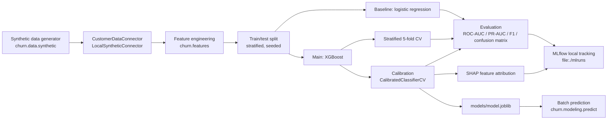

# Subscription Churn Prediction

A cross-validated, calibrated churn-prediction pipeline for a telecom-style
subscription business, built end to end on a documented synthetic dataset.

## Overview

Subscription businesses lose recurring revenue every time a customer
cancels, and retention teams need a ranked, well-calibrated estimate of
which customers are at risk in order to prioritize outreach. This repository
implements that pipeline for a generic telecom-style subscription service:
a documented, seeded synthetic data generator stands in for a real customer
data warehouse (no real company's data is used anywhere), feeding a feature
engineering step, a baseline-vs-main model comparison with stratified
cross-validation, probability calibration, SHAP-based feature attribution,
and local MLflow experiment tracking. The goal is to demonstrate a rigorous,
reproducible modeling workflow -- not to claim a production-ready churn
model, since no real customer data is involved (see [Limitations](#limitations)
and `MODEL_CARD.md`).

## Key Results

From the training run recorded in `reports/train_results.json`
(`n_customers=20000`, churn rate 22.77%, seed 42, 5-fold stratified CV,
decision threshold 0.267 chosen by F1-maximization on cross-validated
out-of-fold training predictions -- see [Evaluation](#evaluation)):

| Metric | Baseline (logistic regression) | Main model (XGBoost, calibrated) |
| --- | --- | --- |
| ROC-AUC | 0.800 | 0.801 |
| PR-AUC | 0.589 | 0.601 |
| F1 (at threshold 0.267) | 0.466 | 0.551 |

Main model 5-fold stratified CV (training split only): ROC-AUC 0.810 +/-
0.007, PR-AUC 0.602 +/- 0.009, F1 0.559 +/- 0.008.

Calibration: out-of-fold Brier score improved from 0.168 (raw XGBoost
output) to 0.131 (`CalibratedClassifierCV`, isotonic), so the calibrated
model is the one shipped in `models/model.joblib`. See
`reports/calibration_curve.png` for the reliability diagram and
`reports/shap_summary.png` for SHAP feature attribution.

These numbers come directly from running `python -m churn.modeling.train`
against the synthetic dataset described below -- they are not estimated.
Re-running with the same seed reproduces them exactly; a different seed or
`n_customers` will shift them somewhat (see `MODEL_CARD.md`).

## Architecture



## Tech stack

- Python 3.12
- pandas / numpy -- synthetic data generation and feature engineering
- scikit-learn 1.5.2 -- pipelines, CV, calibration, metrics
- XGBoost 2.1.2 -- main model
- imbalanced-learn 0.12.4 -- `RandomOverSampler` for class imbalance
- SHAP 0.46.0 -- feature attribution
- MLflow 2.17.2 -- local, file-based experiment tracking (no external server)
- pytest, ruff -- tests and linting
- GitHub Actions -- CI (lint, format check, unit tests, end-to-end smoke test)

## Project structure

```
Churn-Prediction/
├── src/churn/
│   ├── config.py              # env-overridable settings, no real secrets needed
│   ├── data/
│   │   ├── synthetic.py       # seeded synthetic data generator (documented DGP)
│   │   └── connector.py       # CustomerDataConnector ABC + LocalSyntheticConnector
│   ├── features.py            # feature engineering / encoding
│   └── modeling/
│       ├── train.py           # CV, baseline vs main model, oversampling, calibration, MLflow
│       ├── evaluate.py        # metrics, calibration curve, SHAP
│       └── predict.py         # batch scoring with a saved model
├── tests/                     # pytest coverage for generator, connector, features, metrics
├── notebooks/
│   ├── 01_eda.ipynb           # executed EDA notebook
│   └── 02_modeling.ipynb      # executed modeling notebook (same code as train.py)
├── configs/model.yaml         # hyperparameters and thresholds (no magic numbers in code)
├── data/                      # generated data (gitignored); see data/README.md
├── .github/workflows/ci.yml   # lint + format + pytest + end-to-end smoke test
├── pyproject.toml             # pinned dependencies, ruff config, pytest config
├── Makefile                   # install, lint, format, test, data, train, predict
├── LICENSE                    # Apache 2.0
├── MODEL_CARD.md              # intended use, training data, limitations, ethics
└── README.md
```

## Getting started

Requires Python 3.11+.

```bash
make install        # creates .venv and installs pinned dependencies
make data           # generates data/raw/customers.parquet
make train          # trains baseline + main model, logs to ./mlruns, saves models/model.joblib
```

Without `make` (e.g. on Windows PowerShell):

```powershell
python -m venv .venv
.venv\Scripts\python.exe -m pip install -e ".[dev]"
.venv\Scripts\python.exe -m churn.data.synthetic
.venv\Scripts\python.exe -m churn.modeling.train
```

## Usage examples

```bash
# Regenerate the synthetic dataset (deterministic given the seed)
python -m churn.data.synthetic

# Run the full training pipeline: baseline + main model + CV + calibration + SHAP + MLflow
python -m churn.modeling.train

# Batch-score a parquet file of customers with the saved model
python -m churn.modeling.predict --input data/raw/customers.parquet --output data/scored.parquet

# View MLflow experiment tracking UI (local file store, no server needed)
mlflow ui --backend-store-uri file:./mlruns

# Lint, format check, and test
make lint
make format-check
make test
```

## Evaluation

**Baseline comparison.** A logistic regression (same oversampling, same
train/test split) is always trained and reported alongside the main model
-- the main model's metrics are never shown in isolation.

**Cross-validation.** The main model is evaluated with stratified 5-fold CV
on the training split (`churn.modeling.train.run_cv`), reporting mean +/-
std for ROC-AUC, PR-AUC, and F1, so the headline numbers reflect variance
across folds rather than a single lucky split.

**Class imbalance.** `RandomOverSampler` (imbalanced-learn) is applied
inside the training pipeline (fit on the training fold only, never on
validation/test data) rather than using `class_weight`, so the same
resampling step is shared by both the baseline and the main model, keeping
the comparison apples-to-apples (see the comment in `configs/model.yaml`).

**Calibration and decision threshold.** Both the calibration decision
(raw XGBoost output vs. `CalibratedClassifierCV`) and the decision threshold
are chosen from cross-validated out-of-fold predictions on the training
split only, via Brier-score comparison and F1-maximization respectively
(`churn.modeling.evaluate.select_f1_optimal_threshold`). The test set is
touched exactly once, for the final reported metrics -- neither the
calibration choice nor the threshold is tuned against it.

**SHAP.** `reports/shap_summary.png` shows a SHAP beeswarm plot for the
fitted XGBoost model, generated from `churn.modeling.evaluate.plot_shap_summary`.

### Limitations

- **Synthetic data.** Every number above comes from a real run of the code
  in this repo, but the underlying data is synthetic (see
  `src/churn/data/synthetic.py` for the exact generating process). A real
  deployment needs real, governed customer data and a fairness/bias audit
  before using model output to influence any customer-facing decision (see
  `MODEL_CARD.md`).
- **No temporal drift modeling.** The dataset is an i.i.d. snapshot; there
  is no time dimension, seasonality, or concept drift, and this pipeline
  does not include drift monitoring.
- **No causal claims.** SHAP explains model behavior, not causal drivers of
  real customer churn.
- **Single test split for final numbers.** Cross-validation is used for the
  main model's reported CV metrics, but baseline-vs-main head-to-head
  numbers come from one held-out split; expect some variance across seeds.

## Future work

- Add a `serving/` FastAPI endpoint (`POST /predict`) with a Dockerfile, if
  and when it can be shipped as a real, tested service rather than a stub.
- Hyperparameter search (e.g. Optuna) for the XGBoost model instead of the
  fixed configuration in `configs/model.yaml`.
- Try LightGBM as an alternative main model and compare.
- TODO(author): add monitoring for feature/label drift if this is ever
  connected to a real, refreshed data source.

## License

Apache License 2.0 -- see `LICENSE`. Copyright 2026 Taha Alami.

## Author

Taha Alami
